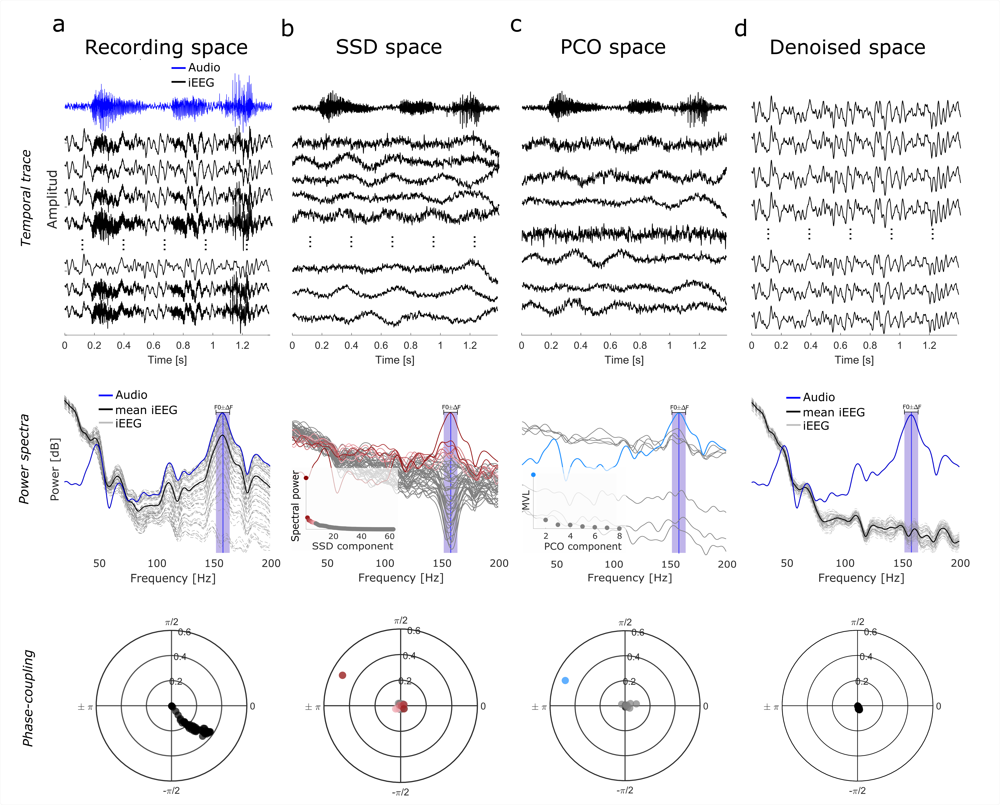

# Phase Coupling Decomposition

<p align="center">

</p>

You will find here all the codes and instructions needed to reproduce the experiments performed in "A supervised data-driven spatial filter denoising method for acoustic-induced artifacts in intracranial electrophysiological recordings ", by 
Victoria Peterson, Matteo Vissani, Shiyu Luo, Qinwan Rabbani, Nathan E. Crone, Alan Bush, and R. Mark Richardson (pre-print [here](https://www.biorxiv.org/content/10.1101/2023.04.05.535577v1.full.pdf))

## Installation guidelines
This guidelines are based on Matlab 2021a.
The library has been tested on Windows.

## Requirements:
To run this library you need to include in your path the following depencies:

* [BML](https://github.com/Brain-Modulation-Lab/bml) toolbox
* [Fieldtrip](https://www.fieldtriptoolbox.org/)
* [Picard](https://github.com/pierreablin/picard)

To run Example_run_HybridSimulation.m you need to compile the mex file:

.. code:: matlab

   >>> mex code_CUBN.c ran1.c gasdev.c 

### Download and run the demos
1. Download and extract the zip or clone [PCD](https://github.com/Brain-Modulation-Lab/pcd)
2. Run the examples:
```
Example_run_pcd.m
```
```
Example_comparison_PCD_CAR_ICA.m
```
```
Example_run_ITPC.m
```
```
Example_run_HybridSimulation.m
```
##### And you are ready. Happy coding!

